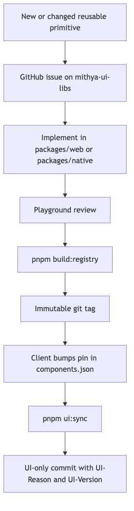

# Mithya Design-to-Development Working Model

## Purpose

Code-first design system. Component source in Git is the design record.

Repos:

- https://github.com/mithya-team/mithya-ui-libs
- https://github.com/mithya-team/mithya-pilot-client
- https://github.com/aniruddha-mithya/mithya-alt-client

This document is the working contract for those three repos.

## Repositories

Web and React Native are packages in **one** lib repo. There are **two client repos**. Pilot (`mithya-pilot-client`) uses `solid`/`ghost`. Alt (`mithya-alt-client`) uses a different theme and `filled`/`outline`/`soft`. Each client has `apps/web` and `apps/native`.

| Repo | What it holds |
|---|---|
| https://github.com/mithya-team/mithya-ui-libs | `packages/web` (React + Tailwind), `packages/native` (React Native + Unistyles), registry JSON, playgrounds |
| https://github.com/mithya-team/mithya-pilot-client | First client: `apps/web`, `apps/native`, `solid` / `ghost` |
| https://github.com/aniruddha-mithya/mithya-alt-client | Second client: `apps/web`, `apps/native`, `filled` / `outline` / `soft` |

Generic libs own reusable primitives, public API, visual identity of those primitives, registry JSON, tags, changelogs.

Each client app owns theme **values**, product-only components, icons that are not generic, and screen composition.

Developers install pinned registry items and stitch data, routing, and product UI. They do not restyle `src/components/ui`.

## How designers work

### Lib designer — `mithya-ui-libs`

Owns primitives in `packages/web` and `packages/native`.

1. Change or add source in the matching package.
2. Show every variant and state in the package playground.
3. Run `pnpm build:registry`.
4. Review the playground. Then tag (example: `v0.1.0`). Tags are immutable.

Skill in that repo: `.cursor/skills/ui-lib-component/SKILL.md`.

Do not put client theme **values** in lib component source. Libs own token **names** (`token-contract.json`).

### Client designer — client repos

Owns `apps/*/src/theme` and `apps/*/src/components/product` in **each** client repo (`mithya-pilot-client`, `mithya-alt-client`).

1. Set color, space, type values in theme files.
2. Build product-only UI under `src/components/product`.
3. Compose screens from locked primitives + product components.
4. Review tokens and variants in Storybook (`pnpm --filter web storybook` or `pnpm --filter native storybook`).

Do not edit `apps/*/src/components/ui`.

Skill in that repo: `.cursor/skills/client-ui-component/SKILL.md`.

### Designer baseline

Designers create reusable primitives in `mithya-ui-libs`. A primitive belongs
here only when its behavior or visual language is reusable across product
surfaces. Product copy, business rules, API calls, permissions, and real
customer data stay in the client repo.

Before implementation, record the purpose, platform, anatomy, public API,
variants, states, accessibility behavior, responsive behavior, token names
(primitive, semantic, or component), and automation hooks. The agent implements this brief. The designer
accepts the result in the playground.

Use `docs/designer-component-workflow.md` for the full baseline and
acceptance checklist.

### Client designer sandbox

The client repo has an explicit designer sandbox:

| Path | Purpose |
|---|---|
| `apps/*/src/components/product/**` | Product components and composition |
| `apps/*/src/theme/**` | Client-owned token values |
| `apps/*/src/theme/variants/**` | CVA (web) or Unistyles variants (native) |
| `apps/*/src/design-sandbox/**` | Typed mock data, preview screens, theme swatches |
| `apps/*/src/stories/**` | Storybook stories for theme, product, and sandbox |
| `apps/web/.storybook/**` | Web Storybook config |
| `apps/native/.rnstorybook/**` | On-device Storybook config |

Designers add product designs in unlocked paths. The sandbox uses deterministic
mock scenarios and test hooks. It must not call APIs, write storage, or contain
business logic. Sandbox notes: `mithya-pilot-client/docs/designer-sandbox.md` and `mithya-alt-client/docs/designer-sandbox.md`.

Storybook is the designer review surface for **client theme and product UI**. Lib primitives stay in the lib playgrounds. Do not put stories under `src/components/ui`.

| App | Command | Notes |
|---|---|---|
| Pilot web | `pnpm --filter web storybook` | `http://127.0.0.1:6006` |
| Alt web | `pnpm --filter web storybook` | `http://127.0.0.1:6007` |
| Pilot native | `pnpm --filter native storybook` | `STORYBOOK_ENABLED=true` swaps the Expo entry. Needs a rebuilt **dev client** after Storybook native deps. |
| Alt native | `pnpm --filter native storybook` | Same entry swap. Alt native is typecheck-only until you prebuild. |

The designer loop is: change product UI, update theme or variant recipes, add or update a mock scenario and Storybook story, review tokens and variants in Storybook, run the platform smoke test against the app sandbox, and record accepted states in the pull request.

## How developers work

### Client developer — client repos

Same commands in `mithya-pilot-client` and `mithya-alt-client`. Package manager is **pnpm**. Do not run `npm i`.

```bash
pnpm install
pnpm ui:init
pnpm ui:sync
pnpm test:shadcn
pnpm typecheck
pnpm --filter web storybook
pnpm --filter web dev
pnpm --filter native storybook
pnpm --filter native ios
```

Native Unistyles uses Nitro. Use a **dev client** (`expo run:ios`). Expo Go is not supported. Clone to a path **without spaces** (Expo iOS scripts split on space).

1. Install pinned items with `pnpm ui:sync`.
2. Write feature / page code. Call APIs. Wire routing.
3. Need a new reusable primitive? Open a GitHub issue on `mithya-ui-libs`. Do not patch the copied shell.

### Lib developer / agent — `mithya-ui-libs`

Same rules as lib designer for source. Follow `.cursor/skills/ui-lib-component/SKILL.md`.

## Designer-to-developer handoff

### Reusable primitive

1. Designer records the component brief.
2. Agent implements the primitive in the lib repo.
3. Designer reviews all playground states and accepts the visual contract.
4. Lib developer rebuilds the registry and creates an immutable tag.
5. Client developer bumps the pin and runs `pnpm ui:sync`.

### Product UI

1. Designer builds the product component in the client repo.
2. Designer adds a typed mock scenario in `apps/*/src/design-sandbox`.
3. Designer adds or updates stories in `apps/*/src/stories` (tokens, variants, product, sandbox).
4. Designer reviews web Storybook and native on-device Storybook, then runs the smoke tests.
5. Developer keeps the visual contract and replaces mock data at the feature boundary.
6. Developer adds real data fetching, mutations, validation, permissions,
   routing, and business rules in feature code.

Mock data proves the visual and interaction contract. It does not prove API or
business behavior. Developers must add integration and data tests for the real
flow.

## What we are not doing

- npm package as the consumer install path.
- Theme values shipped inside locked registry files.
- Community kits as the Mithya system (React Native Reusables, shadniwind, appCN, native-shadcn). Those prove the CLI works. They are other design systems.

## Distribution

Official `shadcn` CLI on **both** platforms. The CLI copies files. It does not require Tailwind on native.

**Command after project setup:** `shadcn add @mithya-web/button` and `shadcn add @mithya-native/button`.

`@mithya-web` is not registered with shadcn. `pnpm ui:init` writes the URL map into that app’s `components.json` once. Do not use `@mithya-web/button@v1` — invalid. Pin lives in the mapped URL (tag path or `params.version`).

```bash
pnpm ui:init
pnpm dlx shadcn add @mithya-web/button
pnpm dlx shadcn add @mithya-native/button
```

`ui:init` equivalent:

```bash
pnpm dlx shadcn registry add @mithya-web=https://mithya-team.github.io/mithya-ui-libs/web/v0.1.0/{name}.json
pnpm dlx shadcn registry add @mithya-native=https://mithya-team.github.io/mithya-ui-libs/native/v0.1.0/{name}.json
```

Pilot registry server in `mithya-ui-libs`: `pnpm serve` → `http://127.0.0.1:3333/web/v0.1.0/{name}.json` (same for `/native/`).

Bump version = change the pin in `components.json` (or `ui:init --version v1.3.0`), then `pnpm ui:sync`.

Public lib repo is the source. GitHub Pages (not yet enabled) or `pnpm serve` for JSON. No npm publish of components. No official shadcn directory PR.

Fallback with no `@` map: `shadcn add mithya-team/mithya-ui-libs/web/button#v0.1.0` once `registry.json` is at the **repo root** (today it lives under `registry/web/` and `registry/native/`). Prefer the `@` form after `ui:init`.

Wrap installs in `pnpm ui:sync`. Never `latest`. Never unpinned `main` in prod.

Native items set explicit `files[].target`. Native `components.json` may use empty Tailwind `config`/`css`. Unistyles does not ship a registry. shadniwind is a **copy-pattern only**. Do not add `@shadniwind/*`.

## Folder contract in the client repo

Paths are per client repo. Each client has `apps/web` and `apps/native`:

| Path | Owner | Git |
|---|---|---|
| `src/components/ui/**` | Generic lib via `shadcn add` (`pnpm ui:sync`) | Locked |
| `src/theme/**` | Client designer | Unlocked |
| `src/components/product/**` | Client designer | Unlocked |
| `src/design-sandbox/**` | Client designer | Unlocked |
| `src/stories/**` | Client designer | Unlocked. Not under `ui/`. |
| Feature / page code | Client developer | Unlocked |

Do not put product components in `src/components/ui`.

## Theme and variant split

Client owns **theme values** at three levels and **variant recipes**. Libs own the primitive **template**. Recipes and product UI may use primitive, semantic, or component token names. Hex/rgb/hsl lives only in primitive value definitions.

| Level | What it changes | Web | Native |
|---|---|---|---|
| Primitive | Raw palette | `--primitive-*` in `theme.css` | `primitive` in `tokens.ts` |
| Semantic | Meaning aliases | `--semantic-*` | `colors`, `space`, `radius` |
| Component | One component only | `--button-*`, `--input-*` | `component.button`, `component.input` |

Change `--primitive-blue-600` to retint every alias that points at it. Change `--semantic-bg-accent` to retint accent uses without editing the palette. Change `--button-solid-bg` to retint solid buttons only.

Locked primitives import `../../theme/variants/<name>` after `shadcn add` (relative, so the CLI does not rewrite `@/` to `@/components/ui/<name>`). They do not define solid/ghost visuals.

| Platform | Theme values | Variant recipes |
|---|---|---|
| Web | `apps/web/src/theme/theme.css` | CVA in `apps/web/src/theme/variants/<name>.ts` |
| Native | `apps/native/src/theme/tokens.ts` + `unistyles.ts` | Unistyles `variants` + `use<Name>Variants` in `apps/native/src/theme/variants/<name>.ts` |

Web recipes may use `bg-primitive-blue-600`, `bg-accent`, or `bg-button-solid`. Native recipes may use `theme.primitive.blue600`, `theme.colors.bg.accent`, or `theme.component.button.solidBg`. Copied files live under `src/components/ui`, so Tailwind scans them in-repo.

Native: client `src/theme/unistyles.ts` calls `StyleSheet.configure` once, before any UI import (`apps/native/index.ts` imports it first).

Registry may ship a type/contract file (`native-theme.ts`) that is locked. It must not ship filled color values. Values stay in unlocked `src/theme/`. Variant recipes are never copied by `shadcn add`.

Light, dark, system: the **app** selects the mode. Components consume the configured theme. Variant recipes read those theme values.

Lib playgrounds ship demo recipes at the same `@/theme/variants/<name>` path so the template can run. Client files replace them.

## As-is rule (copy model)

shadcn copy can transform files. The pin is the registry URL in `components.json` (`v0.1.0` in the path). Do not hand-edit `src/components/ui`.

Integrity is:

1. Pin in `components.json`.
2. `pre-commit` — `src/components/ui/**` changes allowed only with `UI_SYNC=1`.
3. `commit-msg` — UI commits may include `src/components/ui` and `components.json` only.

`pnpm ui:sync` is a wrapper for `shadcn add --yes --overwrite`. From the repo root it runs in every app with `components.json`. From an app directory it runs in that app.

```bash
pnpm ui:sync
pnpm --filter web ui:sync
pnpm ui:sync button
```

Legitimate reasons: first install, or refresh after a pin bump.

## Process — create or update a component



### Reusable primitive (`mithya-ui-libs`)

Follow `.cursor/skills/ui-lib-component/SKILL.md`.

1. Issue on https://github.com/mithya-team/mithya-ui-libs
2. Implement in `packages/web` and/or `packages/native`
3. Playground review
4. `pnpm build:registry`
5. Git tag
6. Client pin bump + `pnpm ui:sync` + UI-only commit

### Product-only (client repos)

Follow `.cursor/skills/client-ui-component/SKILL.md`.

Add files under `src/components/product`, `src/theme`, `src/design-sandbox`, or `src/stories`. No tag. No `ui:sync`. Review in Storybook.

## Platform implementations

Separate libs. No shared component source. Shared token **names** where useful.

- Web: React + Tailwind CSS.
- Native: React Native + Unistyles.

Do not introduce NativeWind or Uniwind unless this document is revised.

Unistyles rules:

- `StyleSheet.configure` once in client theme, before UI imports.
- `StyleSheet.create` for ordinary styles.
- Primitive variants: `StyleSheet.create` + `use<Name>Variants` in `src/theme/variants/<name>.ts`. The locked template calls that hook.
- Do not use `useUnistyles` for ordinary styling.
- Do not add a second theme provider.

## Component contract

Each released component is a stable product API:

- Props, variants, sizes, tones, states.
- Controlled and uncontrolled behavior.
- Forwarded refs and supported imperative behavior.
- Explicit typed slots.
- Disabled, loading, error, empty, selected, read-only.
- Keyboard, pointer, touch, focus, gesture.
- Accessibility: labels, roles, announcements, focus order.
- Test hooks when product automation needs them.
- Overflow, localization, RTL, large text.

Unsupported reusable needs become issues, then public API.

## Customization boundary

Applications place components. The lib owns primitive visuals.

No unrestricted root `className` or `style` on public primitives. Restricted `layout` on the outer element. Restricted `textLayout` on owned text.

Parent composition for position:

```javascript
<div className="absolute top-8 right-8">
  <Button>Save</Button>
</div>
```

### Web layout allowlist

Positioning, external spacing (margin), sizing, parent-layout participation, overflow. No padding, gap, alignItems, justifyContent, color, background, border, typography, shadow, filter, animation, or transform on `layout`.

`textLayout`: whiteSpace, overflowWrap, wordBreak, hyphens, textOverflow, library `lineClamp`.

### Native layout allowlist

Position, margin, sizing, alignSelf, flex, display, overflow.

`textLayout`: numberOfLines, ellipsizeMode, allowFontScaling, maxFontSizeMultiplier, adjustsFontSizeToFit, minimumFontScale.

Same bans as web for internal appearance. Translation transforms stay on wrappers.

## Slots and composition

Typed slots only (`iconLeft`, `header`, `emptyState`, …). Slots are not a restyle hatch. Raw internals stay private unless another lib component needs them.

## Icons, fonts, animation, dependencies

Phosphor is the generic icon set.

Generic reusable icons: generic lib / registry item. Client-specific icons: client app (`src/components/product` or `src/assets`), not the generic lib.

Fonts and motion: tokens. New large UI/icon/animation runtimes need a lib issue.

Registry items declare npm deps the CLI must install (Unistyles, Phosphor, …).

## Agent rules

Lib agents (in `mithya-ui-libs`):

- No raw hex/rgb/hsl in templates or recipes. Token names may be primitive, semantic, or component.
- No root `className`/`style` escape hatches.
- New visual variant → CVA / Unistyles recipe in the client `src/theme/variants`.
- New primitive behavior or template API → change in the lib, then tag and `ui:sync`.
- Load `.cursor/skills/ui-lib-component/SKILL.md`.

Client agents (in `mithya-pilot-client` and `mithya-alt-client`):

- Do not edit `src/components/ui/**`.
- Theme, variant recipes, product UI, and Storybook stories only in unlocked paths.
- Install via `pnpm ui:sync`, never by hand-copy.
- Load `.cursor/skills/client-ui-component/SKILL.md`.

Formatting is not a quality gate.

## Quality gates

### `mithya-ui-libs`

- Playground review before tag.
- `pnpm build:registry` produces `registry/web|native/v*/{name}.json`.
- No raw hex in recipes. Token names may be primitive, semantic, or component.

### Client repos

Same in `mithya-pilot-client` and `mithya-alt-client`.

`scripts/check-ui-lock.sh` on pre-commit:

- UI staged paths only with `UI_SYNC=1`.
- Theme/product/story paths unrestricted by this script.

`scripts/check-ui-commit-msg.sh`: UI commits may include `src/components/ui` and `components.json` only.

Web Storybook: `pnpm --filter web storybook` (pilot `:6006`, alt `:6007`).

Native Storybook: `pnpm --filter native storybook` (`STORYBOOK_ENABLED=true`). Rebuild the Expo **dev client** after adding Storybook native modules.

Web smoke (pilot): `pnpm --filter web test:e2e` (Playwright).

Native smoke (pilot): Maestro `apps/native/maestro/smoke.yaml` on the iOS simulator after `pnpm --filter native ios`.

Alt client: `pnpm test:shadcn` and `pnpm typecheck`. Native alt has no iOS prebuild in this pilot.

## Issues, releases, support

Labels: `component:new`, `component:change`, `component:bug`, `platform:web`, `platform:native`, `theme`, `icon-or-asset`, `accessibility`, `behavior`, `project-specific`, `needs-design-decision`, `accepted`.

```
## Problem / use case

## Target platform
Web / React Native / both (separate implementations)

## Requested change
New component / new variant / new prop / behavior change

## Existing component considered

## Proposed API

## Required states and interactions

## Ref, accessibility, and test-hook requirements

## Icon or asset requirements

## Is this shared-system or project-specific?
```

Tags are immutable. Old tags stay installable. Only latest gets fixes. Client pins the tag.

## Pilot

Greenfield. Repos are public.

- Lib: https://github.com/mithya-team/mithya-ui-libs — `packages/web`, `packages/native`, registry JSON, `pnpm serve` on `127.0.0.1:3333`
- First client: https://github.com/mithya-team/mithya-pilot-client — `solid` / `ghost`
- Second client: https://github.com/aniruddha-mithya/mithya-alt-client — `filled` / `outline` / `soft`

Attack tests (web + native): edit `ui/button` without `UI_SYNC=1` → hook fail; theme/product edit → pass; mixed ui+feature → hook fail.

Pass: product/theme can change; generic UI cannot, except by versioned sync commit.

## After the pilot — host

**Default command:** `shadcn add @mithya-web/button` after `pnpm ui:init`.

`ui:init` writes `@mithya-web` and `@mithya-native` into `components.json`. Do not PR the official shadcn directory.

**Now:** localhost `pnpm serve` from `mithya-ui-libs`.

**Next:** enable GitHub Pages on `mithya-ui-libs`. Theme values stay in the client repo.

GitHub item address (optional): `mithya-team/mithya-ui-libs/...#tag` only after a root `registry.json`.

| Role | Access |
|---|---|
| Lib designer | Write https://github.com/mithya-team/mithya-ui-libs ; tag after playground review |
| Everyone else | Clone a client (`mithya-pilot-client` or `mithya-alt-client`); `ui:init` once, then `pnpm ui:sync` / `shadcn add @mithya-web/button` |
| Client CI | Public fetch; no registry PAT |
