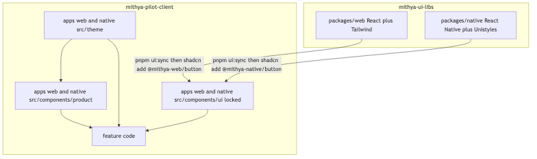
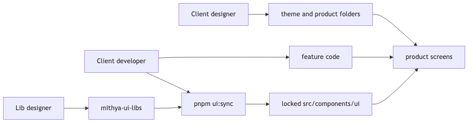

# Component Library Working Model

## Purpose

Code-first design system. Component source in Git is the design record.

Repos:

- https://github.com/mithya-team/mithya-ui-libs
- https://github.com/mithya-team/mithya-pilot-client

This document is the working contract for those two repos.

## Repositories

Web and React Native are packages in **one** lib repo. The client repo has two apps.

| Repo | What it holds |
|---|---|
| https://github.com/mithya-team/mithya-ui-libs | `packages/web` (React + Tailwind), `packages/native` (React Native + Unistyles), registry JSON, playgrounds |
| https://github.com/mithya-team/mithya-pilot-client | `apps/web`, `apps/native`, theme values, product components, locked `ui` copies, feature code |





Generic libs own reusable primitives, public API, visual identity of those primitives, registry JSON, tags, changelogs.

Each client app owns theme **values**, product-only components, icons that are not generic, and screen composition.

Developers install pinned registry items and stitch data, routing, and product UI. They do not restyle `src/components/ui`.

## How designers work

### Lib designer — `mithya-ui-libs`

Owns primitives in `packages/web` and `packages/native`.

1. Change or add source in the matching package.
2. Show every variant and state in the package playground.
3. Run `pnpm build:registry`.
4. Review the playground. Then tag (example: `v0.1.0`). Tags are immutable.

Skill in that repo: `.cursor/skills/ui-lib-component/SKILL.md`.

Do not put client theme **values** in lib component source. Libs own token **names** (`token-contract.json`).

### Client designer — `mithya-pilot-client`

Owns `apps/web/src/theme`, `apps/native/src/theme`, and `apps/*/src/components/product`.

1. Set color, space, type values in theme files.
2. Build product-only UI under `src/components/product`.
3. Compose screens from locked primitives + product components.

Do not edit `apps/*/src/components/ui`.

Skill in that repo: `.cursor/skills/client-ui-component/SKILL.md`.

## How developers work

### Client developer — `mithya-pilot-client`

Package manager is **pnpm**. Do not run `npm i`. `npm i` re-runs Unistyles `prepare` (`bob build`) and fails.

```bash
pnpm install
pnpm ui:init
pnpm ui:sync
pnpm --filter web dev
pnpm --filter native ios
```

Native Unistyles uses Nitro. Use a **dev client** (`expo run:ios`). Expo Go is not supported. Clone to a path **without spaces** (Expo iOS scripts split on space).

1. Install pinned items with `pnpm ui:sync`.
2. Write feature / page code. Call APIs. Wire routing.
3. Need a new reusable primitive? Open a GitHub issue on `mithya-ui-libs`. Do not patch the copied shell.

### Lib developer / agent — `mithya-ui-libs`

Same rules as lib designer for source. Follow `.cursor/skills/ui-lib-component/SKILL.md`.

## What we are not doing

- npm package as the consumer install path.
- Theme values shipped inside locked registry files.
- Community kits as the Mithya system (React Native Reusables, shadniwind, appCN, native-shadcn). Those prove the CLI works. They are other design systems.

## Distribution

Official `shadcn` CLI on **both** platforms. The CLI copies files. It does not require Tailwind on native.

**Command after project setup:** `shadcn add @mithya-web/button` and `shadcn add @mithya-native/button`.

`@mithya-web` is not registered with shadcn. `pnpm ui:init` writes the URL map into that app’s `components.json` once. Do not use `@mithya-web/button@v1` — invalid. Pin lives in the mapped URL (tag path or `params.version`).

```bash
pnpm ui:init
pnpm dlx shadcn add @mithya-web/button
pnpm dlx shadcn add @mithya-native/button
```

`ui:init` equivalent:

```bash
pnpm dlx shadcn registry add @mithya-web=https://mithya-team.github.io/mithya-ui-libs/web/v0.1.0/{name}.json
pnpm dlx shadcn registry add @mithya-native=https://mithya-team.github.io/mithya-ui-libs/native/v0.1.0/{name}.json
```

Pilot registry server in `mithya-ui-libs`: `pnpm serve` → `http://127.0.0.1:3333/web/v0.1.0/{name}.json` (same for `/native/`).

Bump version = change the pin in `components.json` (or `ui:init --version v1.3.0`), then `pnpm ui:sync` with `UI-Reason: refresh`.

Public lib repo is the source. GitHub Pages (not yet enabled) or `pnpm serve` for JSON. No npm publish of components. No official shadcn directory PR.

Fallback with no `@` map: `shadcn add mithya-team/mithya-ui-libs/web/button#v0.1.0` once `registry.json` is at the **repo root** (today it lives under `registry/web/` and `registry/native/`). Prefer the `@` form after `ui:init`.

Wrap installs in `pnpm ui:sync`. Never `latest`. Never unpinned `main` in prod.

Native items set explicit `files[].target`. Native `components.json` may use empty Tailwind `config`/`css`. Unistyles does not ship a registry. shadniwind is a **copy-pattern only**. Do not add `@shadniwind/*`.

## Folder contract in the client repo

Paths are per app (`apps/web`, `apps/native`):

| Path | Owner | Git |
|---|---|---|
| `src/components/ui/**` | Generic lib via CLI | Locked |
| `ui.lock.json` | Generated by `ui:sync` | Locked |
| `src/theme/**` | Client designer | Unlocked |
| `src/components/product/**` | Client designer | Unlocked |
| Feature / page code | Client developer | Unlocked |

Do not put product components in `src/components/ui`.

## Theme split

Libs own **semantic token names**. Client owns **values**.

Web: client `src/theme/theme.css` defines CSS variables. Installed components use semantic Tailwind utilities only (`bg-surface`, `text-fg-muted`). Copied files live under `src/components/ui`, so Tailwind scans them in-repo.

Native: client `src/theme/unistyles.ts` calls `StyleSheet.configure` once, before any UI import (`apps/native/index.ts` imports it first). Theme objects `satisfies NativeTheme`. Components use `StyleSheet.create((theme) => …)` and semantic keys only.

Registry may ship a type/contract file (`native-theme.ts`) that is locked. It must not ship filled color/spacing values. Values stay in unlocked `src/theme/`.

Light, dark, system: the **app** selects the mode. Components consume the configured theme.

## As-is rule (copy model)

shadcn copy does not give as-is by default. Integrity is:

1. `ui.lock.json` — item, version, path, sha256.
2. `pre-commit` — `src/components/ui/**` changes allowed only with `UI_SYNC=1` and hash verify.
3. `commit-msg` — UI commits are UI-only (those files + `ui.lock.json`). Message trailers required.
4. `pnpm verify:ui` — **refetch** the pinned registry artifact and diff. Local lock is a cache.

`git commit --no-verify` is why CI refetch exists.

### `pnpm ui:sync`

Fetches the pinned items, writes files, writes `ui.lock.json`, prints the commit command.

Legitimate reasons only:

- `first-install`
- `refresh` (version bump or re-copy of the same pin)

```
ui(web): button@v0.1.0

UI-Reason: first-install
UI-Version: v0.1.0
```

Hook rejects mixed commits (feature code + `ui/`). Hook rejects UI commits without trailers. Hook rejects hash mismatch.

## Process — create or update a component


### Reusable primitive (`mithya-ui-libs`)

Follow `.cursor/skills/ui-lib-component/SKILL.md`.

1. Issue on https://github.com/mithya-team/mithya-ui-libs
2. Implement in `packages/web` and/or `packages/native`
3. Playground review
4. `pnpm build:registry`
5. Git tag
6. Client pin bump + `pnpm ui:sync` + UI-only commit

### Product-only (`mithya-pilot-client`)

Follow `.cursor/skills/client-ui-component/SKILL.md`.

Add files under `src/components/product` or change `src/theme`. No tag. No `ui:sync`.

## Platform implementations

Separate libs. No shared component source. Shared semantic token **names** where useful.

- Web: React + Tailwind CSS.
- Native: React Native + Unistyles.

Do not introduce NativeWind or Uniwind unless this document is revised.

Unistyles rules:

- `StyleSheet.configure` once in client theme, before UI imports.
- `StyleSheet.create` for ordinary styles.
- Do not use `useUnistyles` for ordinary styling.
- Do not add a second theme provider.

## Component contract

Each released component is a stable product API:

- Props, variants, sizes, tones, states.
- Controlled and uncontrolled behavior.
- Forwarded refs and supported imperative behavior.
- Explicit typed slots.
- Disabled, loading, error, empty, selected, read-only.
- Keyboard, pointer, touch, focus, gesture.
- Accessibility: labels, roles, announcements, focus order.
- Test hooks when product automation needs them.
- Overflow, localization, RTL, large text.

Unsupported reusable needs become issues, then public API.

## Customization boundary

Applications place components. The lib owns primitive visuals.

No unrestricted root `className` or `style` on public primitives. Restricted `layout` on the outer element. Restricted `textLayout` on owned text.

Parent composition for position:

```javascript
<div className="absolute top-8 right-8">
  <Button>Save</Button>
</div>
```

### Web layout allowlist

Positioning, external spacing (margin), sizing, parent-layout participation, overflow. No padding, gap, alignItems, justifyContent, color, background, border, typography, shadow, filter, animation, or transform on `layout`.

`textLayout`: whiteSpace, overflowWrap, wordBreak, hyphens, textOverflow, library `lineClamp`.

### Native layout allowlist

Position, margin, sizing, alignSelf, flex, display, overflow.

`textLayout`: numberOfLines, ellipsizeMode, allowFontScaling, maxFontSizeMultiplier, adjustsFontSizeToFit, minimumFontScale.

Same bans as web for internal appearance. Translation transforms stay on wrappers.

## Slots and composition

Typed slots only (`iconLeft`, `header`, `emptyState`, …). Slots are not a restyle hatch. Raw internals stay private unless another lib component needs them.

## Icons, fonts, animation, dependencies

Phosphor is the generic icon set.

Generic reusable icons: generic lib / registry item. Client-specific icons: client app (`src/components/product` or `src/assets`), not the generic lib.

Fonts and motion: tokens. New large UI/icon/animation runtimes need a lib issue.

Registry items declare npm deps the CLI must install (Unistyles, Phosphor, …).

## Agent rules

Lib agents (in `mithya-ui-libs`):

- Semantic tokens only. No hex/rgb/hsl, no arbitrary visual Tailwind, no primitive token names in component source.
- No root `className`/`style` escape hatches.
- New need → variant/prop in the lib, not a one-off in a consumer.
- Load `.cursor/skills/ui-lib-component/SKILL.md`.

Client agents (in `mithya-pilot-client`):

- Do not edit `src/components/ui/**`.
- Theme and product UI only in unlocked paths.
- Install via `pnpm ui:sync`, never by hand-copy.
- Load `.cursor/skills/client-ui-component/SKILL.md`.

Formatting is not a quality gate.

## Quality gates

### `mithya-ui-libs`

- Playground review before tag.
- `pnpm build:registry` produces `registry/web|native/v*/{name}.json`.
- Semantic tokens only in component source.

### `mithya-pilot-client`

`scripts/check-ui-lock.sh` on pre-commit:

- UI staged paths only with `UI_SYNC=1`.
- Hashes match refetch of `components.json` pins.
- Commit trailers `UI-Reason` + `UI-Version`.
- Theme/product paths unrestricted by this script.

Web smoke: `pnpm --filter web test:e2e` (Playwright).

Native smoke: Maestro `apps/native/maestro/smoke.yaml` on the iOS simulator after `pnpm --filter native ios`.

## Issues, releases, support

Labels: `component:new`, `component:change`, `component:bug`, `platform:web`, `platform:native`, `theme`, `icon-or-asset`, `accessibility`, `behavior`, `project-specific`, `needs-design-decision`, `accepted`.

```
## Problem / use case

## Target platform
Web / React Native / both (separate implementations)

## Requested change
New component / new variant / new prop / behavior change

## Existing component considered

## Proposed API

## Required states and interactions

## Ref, accessibility, and test-hook requirements

## Icon or asset requirements

## Is this shared-system or project-specific?
```

Tags are immutable. Old tags stay installable. Only latest gets fixes. Client pins the tag.

## Pilot

Greenfield. Repos are public.

- Lib: https://github.com/mithya-team/mithya-ui-libs — `packages/web`, `packages/native`, registry JSON, `pnpm serve` on `127.0.0.1:3333`
- Client: https://github.com/mithya-team/mithya-pilot-client — `apps/web`, `apps/native`, `ui:sync`, lock hooks

Attack tests (web + native): edit `ui/button` → verify fail; forged lock hashes → refetch fail; theme/product edit → pass; mixed ui+feature without `UI_SYNC` → hook fail.

Pass: product/theme can change; generic UI cannot, except by versioned sync commit.

## After the pilot — host

**Default command:** `shadcn add @mithya-web/button` after `pnpm ui:init`.

`ui:init` writes `@mithya-web` and `@mithya-native` into `components.json`. Do not PR the official shadcn directory.

**Now:** localhost `pnpm serve` from `mithya-ui-libs`.

**Next:** enable GitHub Pages on `mithya-ui-libs`. Theme values stay in the client repo.

GitHub item address (optional): `mithya-team/mithya-ui-libs/...#tag` only after a root `registry.json`.

| Role | Access |
|---|---|
| Lib designer | Write https://github.com/mithya-team/mithya-ui-libs ; tag after playground review |
| Everyone else | Clone https://github.com/mithya-team/mithya-pilot-client ; `ui:init` once, then `shadcn add @mithya-web/button` |
| Client CI | Public fetch; no registry PAT |
